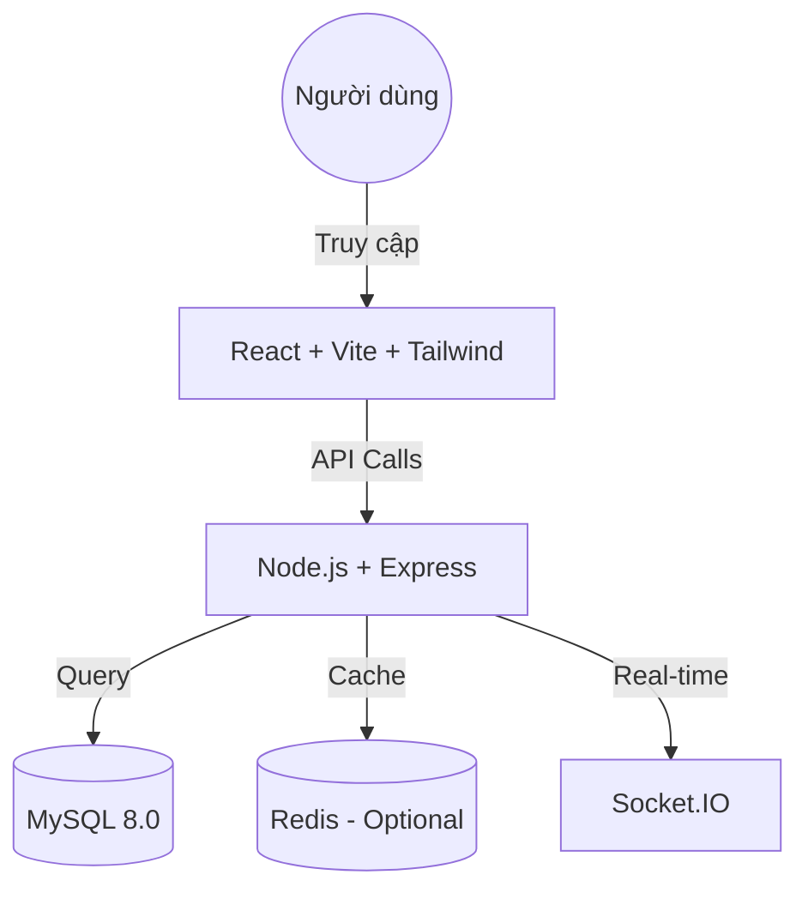

# 🛒 Web Bán Hàng & Quản Lý Kho (Enterprise Grade)

Hệ thống quản lý bán hàng, kho bãi và cộng đồng mua bán hiện đại, được tối ưu cho hiệu năng và bảo mật. Phù hợp cho cả môi trường học tập và Production.

[](https://nodejs.org/)
[](https://www.mysql.com/)
[](https://reactjs.org/)
[](https://opensource.org/licenses/MIT)

---

## 🏗️ Kiến Trúc Hệ Thống



---

## 🛠️ Yêu cầu hệ thống (Prerequisites)

Trước khi bắt đầu, hãy đảm bảo máy tính của bạn đã cài đặt:

1.  **Node.js** (Phiên bản 18 trở lên): [Tải tại đây](https://nodejs.org/)
2.  **MySQL Server** (Phiên bản 8.0): [Tải tại đây](https://dev.mysql.com/downloads/installer/)
3.  **Git**: [Tải tại đây](https://git-scm.com/downloads)
4.  **Docker** (Tùy chọn - nếu muốn chạy nhanh): [Tải tại đây](https://www.docker.com/products/docker-desktop/)

---

## 🚀 Hướng Dẫn Cài Đặt Chi Tiết (Cho Người Mới)

### Bước 1: Tải mã nguồn
Mở Terminal (hoặc CMD/PowerShell) và chạy lệnh:
```bash
git clone https://github.com/ThanhDuy-2006/DEMO_WEB.git
cd DEMO_WEB
```

### Bước 2: Cấu hình Cơ Sở Dữ Liệu (Database)
Đây là bước quan trọng nhất. Hãy làm theo trình tự:

1.  Mở **MySQL Workbench** hoặc công cụ quản lý DB của bạn.
2.  Tạo một database mới tên là `testdb` (hoặc tên tùy ý):
    ```sql
    CREATE DATABASE testdb CHARACTER SET utf8mb4 COLLATE utf8mb4_unicode_ci;
    ```
3.  Bạn **không cần** import SQL thủ công. Hệ thống sẽ tự động tạo bảng khi khởi động lần đầu.

### Bước 3: Cấu hình Biến Môi Trường (.env)

**Tại Backend:**
1.  Vào thư mục `backend`.
2.  Copy file `.env.example` thành `.env`.
3.  Mở `.env` và chỉnh sửa thông tin kết nối database:
    ```env
    DB_HOST=localhost
    DB_USER=root          # Username của MySQL (thường là root)
    DB_PASSWORD=your_password  # Mật khẩu MySQL của bạn
    DB_NAME=testdb
    JWT_SECRET=your_random_string_here
    ```

**Tại Frontend:**
1.  Vào thư mục `frontend`.
2.  Copy file `.env.example` thành `.env`.
3.  Kiểm tra `VITE_API_URL` đã đúng port của backend chưa (mặc định http://localhost:3000/api).

### Bước 4: Cài đặt và Chạy

**Mở 2 cửa sổ Terminal riêng biệt:**

**Terminal 1 (Backend):**
```bash
cd backend
npm install
npm run dev
```
*Khi thấy dòng `✅ MySQL Connected successfully` và `✅ Database Migration Completed` là bạn đã thành công.*

**Terminal 2 (Frontend):**
```bash
cd frontend
npm install
npm run dev
```

Truy cập hệ thống tại: **http://localhost:5173**

---

## 🐳 Cách 2: Chạy bằng Docker (Nhanh nhất)

Nếu bạn đã cài Docker, chỉ cần 1 lệnh duy nhất tại thư mục gốc:
```bash
docker-compose up -d --build
```
Hệ thống sẽ tự chuẩn bị mọi thứ (DB, Redis, Backend, Frontend).

---

## ✨ Tính Năng Nổi Bật

-   **Hệ thống Auth**: Đăng nhập, đăng ký, quên mật khẩu, chuyển đổi Access/Refresh Token bảo mật.
-   **Quản lý Kho**: Quản lý sản phẩm theo nhà (House/Community), nhập xuất kho.
-   **Giao dịch**: Hệ thống ví điện tử, lịch sử giao dịch, nạp tiền.
-   **Bản thực tế (Production Ready)**:
    -   Tự động backup database hàng ngày.
    -   Giới hạn truy cập (Rate Limiting).
    -   Nén dữ liệu (Compression) và bảo mật header (Helmet).
-   **Real-time**: Thông báo và trò chuyện trực tiếp qua Socket.IO.

---

## 📂 Cấu trúc dự án

```text
├── backend/            # API & Logic nghiệp vụ
│   ├── src/
│   │   ├── modules/    # Chia theo tính năng (Auth, Products, Orders...)
│   │   ├── utils/      # Tiện ích (DB, Redis, Socket)
│   │   └── scripts/    # Script khởi tạo DB & Seeding
├── frontend/           # Giao diện người dùng (React Vite)
│   ├── src/
│   │   ├── components/ # UI Reusable components
│   │   ├── modules/    # Logic theo trang
│   │   └── features/   # Business units
└── docker-compose.yml  # File cấu hình Docker
```

---

## ❓ Các lỗi thường gặp (Troubleshooting)

1.  **Lỗi kết nối database (ER_ACCESS_DENIED_ERROR):**
    -   Kiểm tra lại `DB_USER` và `DB_PASSWORD` trong file `backend/.env`.
    -   Đảm bảo MySQL Server đang chạy.
2.  **Lỗi `npm install` bị treo:**
    -   Hãy thử dùng: `npm install --legacy-peer-deps`.
3.  **Port 3000 đã bị sử dụng:**
    -   Đổi `PORT=xxxx` trong file `.env` của backend và cập nhật lại ở frontend.

---

## 🤝 Đóng góp
Chúng tôi hoan nghênh mọi đóng góp! Vui lòng tạo Issue hoặc gửi Pull Request.

## 📄 License
Phát hành dưới giấy phép [MIT](LICENSE).
